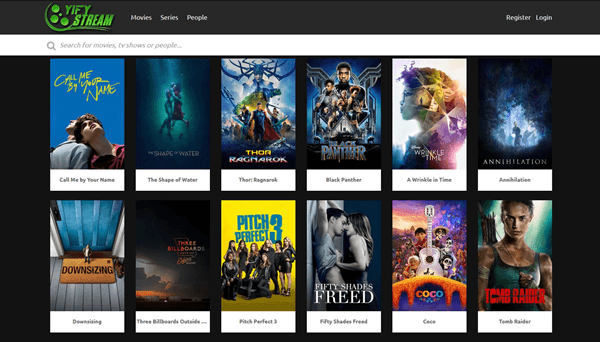

# **Movies Recommendation System**

## Business Understanding

In today's streaming industry, companies like Netflix, Hulu, and Amazon Prime Video face the challenge of providing users with relevant content that matches their preferences. With vast movie catalogs, it can be overwhelming for users to find films they enjoy, leading to lower engagement and subscription cancellations. 

 An intelligent movie recommendation system can help users discover films that match their tastes, enhancing user satisfaction and platform engagement. This system can boost user retention, increase viewing time, and create personalized experiences, benefiting both users and the platform.

 # Problem statement

 With the rise of movie streaming platforms  navigating through  collections  of movies and TV shows, users have been overwhelmed in choosing what they want to watch.
The goal is to predict user preferences based on past interactions (such as ratings) and recommend movies they are likely to enjoy. This involves building a collaborative filtering system that leverages user-item interactions, ratings, and predictions to improve user satisfaction by providing accurate and relevant movie suggestions.

# Stakeholders

The primary stakeholders are:

- **Streaming platforms**: They benefit from increased user engagement and retention by offering personalized recommendations.

- **Users**: They receive tailored suggestions, improving their movie-watching experience.

# Objectives

## General Objective

- Build a recommendation system that improves user engagement by providing relevant movie suggestions.

## Specific Objectives

1. To build  a collaborative filtering model  that recommends movies to users based on their previous ratings and the behavior of similar users.

2. To use past user ratings to predict ratings for unrated movies. 

3.  To provide personalized movies recommendations.

## Data Understanding

### Data Source
The data for this project comes from the **MovieLens dataset** https://grouplens.org/datasets/movielens/latest/, a widely-used benchmark dataset provided by the GroupLens research group at the University of Minnesota. This dataset is designed specifically for building and testing recommendation systems, making it highly relevant for our project.

We are using the **MovieLens small dataset** (ml-latest-small), which contains:

- **Ratings**: User ratings for different movies.
- **Movies**: Information about movie titles and genres.
- **Tags**: User-generated tags for movies.
- **Links**: Metadata connecting movies to external resources like IMDb.

**Data Preparation**

Dataset cleaning was done by checking missing data, duplicates, converting variables to appropriate data types and appropriate feature transformations was done and applied to modelling.

**Modeling**

The baseline models were KNN basic, KNN means, KNN Baseline and SVD models. 

**Evaluation**

SVD performs the best with the lowest RMSE of 0.8746, indicating it has the most accurate predictions in terms of minimizing error.
KNNBaseline is a close second with an RMSE of 0.8772, which is still very good and competitive with SVD.
KNNWithMeans performs moderately well with an RMSE of 0.9002, better than KNNBasic but worse than the other models.
KNNBasic has the highest RMSE of 0.9708, suggesting it is the least accurate model among the ones compared.

**Conclusion**

After model tuning, SVD performs best with the lowest RMSE of 0.8696 as compared to other models hence best choice to use in our recommendation system. The results indicate that the choice of model and tuning parameters significantly impacts performance. SVD's ability to leverage latent factors appears crucial for achieving better accuracy in this context.

**Recommendations**
1. Use hybrid recommendation approach that combines collaborative filtering (e.g., KNN, SVD) with content-based filtering. This will leverage both user ratings and metadata (tags, genres) for improved accuracy. This can be attained by assessing the performance of each method and adjusting weights in the hybrid model based on empirical results.

2. Incorporate user-generated tags to enrich the content-based filtering component. Analyze tag frequencies and their relationships with genres to create more nuanced features. Consider multi-label approaches for genres, as movies can belong to multiple categories. This can enhance the recommendations for users with diverse tastes.

3. Incorporate User Feedback
Implement a system to gather user feedback on recommendations (e.g., thumbs up/down, ratings). Use this data to refine models and adapt to changing user preferences.
Build dynamic user profiles that evolve based on user interactions over time.
